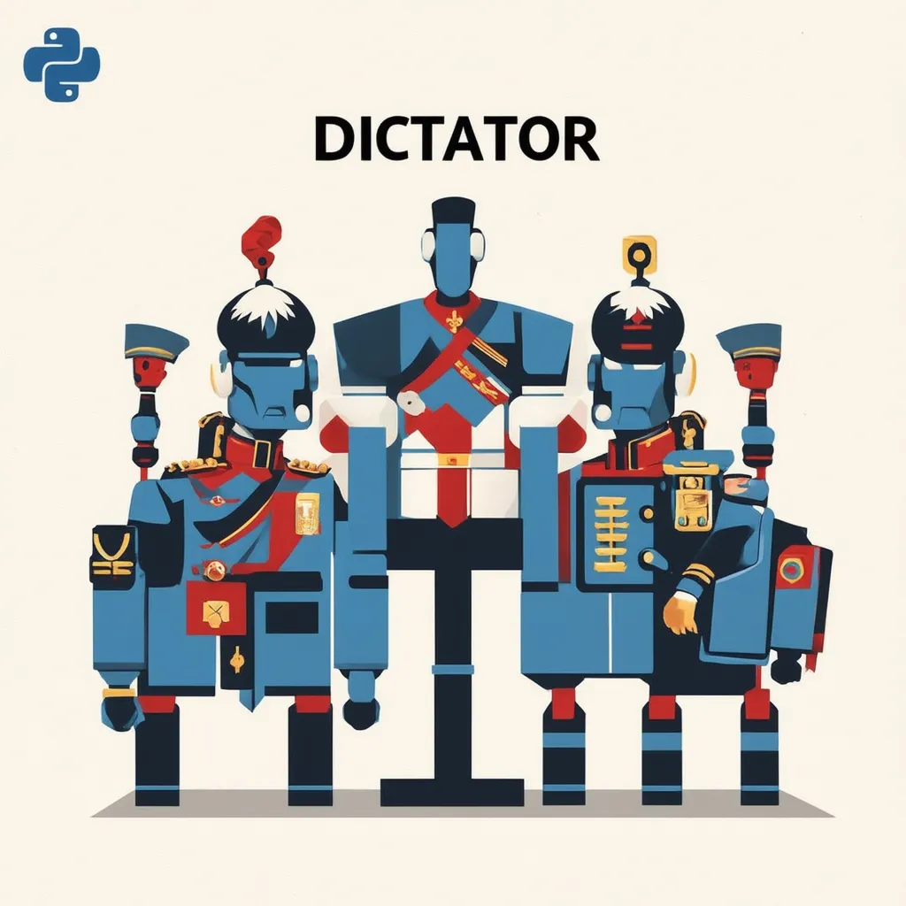

# DictatorGenAI Framework



## Introduction

**DictatorGenAI** is an innovative multi-agent framework designed to facilitate effective interactions between humans and AI agents. Inspired by organizational hierarchies, the framework allows you to simulate a regime where a **dictator** (main agent) and **generals** (supporting agents) collaborate to solve complex tasks. Each agent possesses unique capabilities and expertise, enabling the system to select the most suitable agents for a given task.

## Features

- **Multi-Agent Collaboration**: Simulate interactions between multiple AI agents with specialized skills.
- **Dynamic Agent Selection**: Automatically select and prioritize agents based on their relevance to the task.
- **Hierarchical Structure**: Implement a command chain with dictators and generals for organized task execution.
- **Event Management**: Subscribe to events such as task start, update, completion, and failure.
- **Customizable Agents**: Define agents with specific capabilities and integrate different NLP models.

## Installation

```bash
pip install dictatorgenai